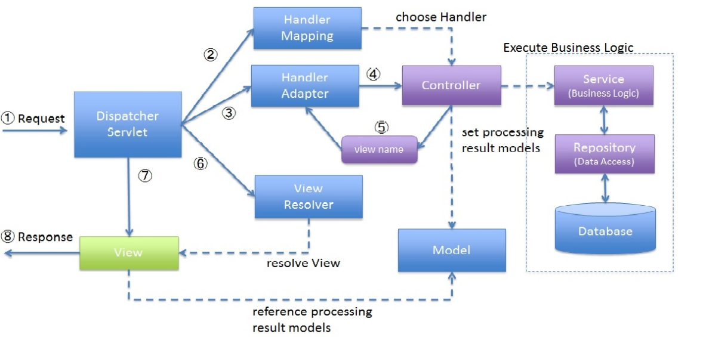

# mvc-framework-practice

## 프런트 컨트롤러 패턴

- 모든 요청을 단일 handler(처리기)에서 처리하도록 하는 패턴
- 스프링 웹 MVC 프레임워크의 DispatcherServlet(프런트 컨트롤러 역할)이 프런트 컨트롤러 패턴으로 구현돼 있음


## Forward vs Redirect

### Forward
- 서블릿에서 클라이언트(웹 브라우저)를 거치지 않고 바로 다른 서블릿(또는 JSP)에
게 요청하는 방식
- Forward 방식은 서버 내부에서 일어나는 요청이기 때문에 HttpServletRequest,
HttpServletResponse객체가 새롭게 생성되지 않음(공유됨)
- ```
  RequestDispatcher dispatcher = request.getRequestDispatcher("포워드 할서블릿 또는 JSP");
  dispatcher.forward(request, response);
  ```


### Redirect

- 서블릿이 클라이언트(웹 브라우저)를 다시 거쳐 다른 서블릿(또는 JSP)에게 요청하는 방식
- Redirect 방식은 클라이언트로부터 새로운 요청이기 때문에 새로운 HttpServletRequest, HttpServletResponse 객체가 생성됨
- HttpServletResponse 객체의 sendRedirect() 이용

## Tomcat 서버 띄울 때 주의할 점

- 세팅에서 gradle에서 빌드러닝을 Gradle -> Intellij IDEA로 변경해주기
- Project Structure에서 -> 모듈을 들어가서 -> Main -> Output Path 를 '프로젝트경로\webapp(s)\WEB-INF\classes' 로 설정한다


## 실습

애노테이션 기반 MVC 프레임 워크 만들기

- DispatcherServlet
- AnnotationHandlerMapping
- HandlerAdpater
- ViewResolver


https://www.w3schools.blog/spring-mvc-execution-flow